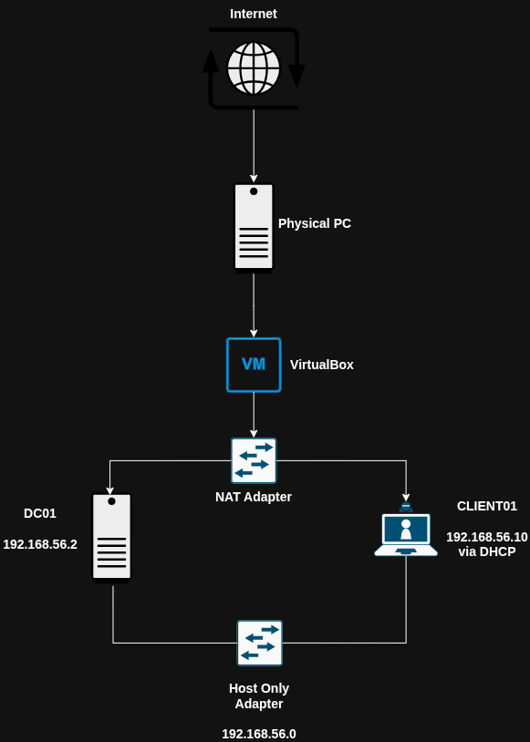

# Active Directory Homelab

Welcome to my Active Directory Project Repository

This repository documents my journey into a practical hands-on Active Directory home lab built with Windows Server 2019, Windows 10, and Oracle Virtualbox

## Objectives

- Setting up Active Directory homelab environment
- Active Directory Installation & Configuration
- Setting up DHCP
- Creating Organizational Units (OUs)
- Creating Users
- Creating Security Groups
- Adding Users to Groups
- Adding Windows clients to OUs
- Creating and Push Group Policy Objects (GPO)
- Test the GPO

## Topology Diagram

## IP Addressing Scheme

| Device   | IP Address   |      Role         |
|----------|--------------|-------------------|
| DC01     | 192.168.56.2 | Domain Controller |
| CLIENT01 | DHCP         | Domain Client     |

## Implementation

### VirtualBox Network Configuration

1. Host-Only Adapter Configuration
   

2. Windows 10 Network Configuration
   

3. Windows Server 2019 Network Configuration
   

### Windows 10 (CLIENT01) Network Configuration

### Windows Server 2019 (DC01) Network Configuration

### Active Directory Installation & Configuration

This section describes how to install and configure active directory in DC01

1. Server Manager -> Dashboard -> Add Roles and Features

2. Select Active Directory Services

3. Select Add Features

4. Select Install

5. Promote DC01 to Domain Controller

6. Select Add a New Forest, then set the Root domain name to `corp.local`

7. Set DSRM password

8. Select defaults in the following sections till you reach Prerequisites Check, then Select Install

### Setting up DHCP 

This section describes how to set up the DHCP server inside DC01, so that CLIENT01 can dynamically obtain its IP Address

1. Go Tools in Server Manager and select DHCP (DHCP services must be installed first)

2. Expand the server name, click IPv4, then choose New Scope

3. Click Next, then create a name for the Network Scope, and click Next

4. Create DHCP Pool : Configure Start Address, End Address, Subnet Mask

5. Add IP Exclusions (optional) : Add any specific IP Address that you want to reserve from the IP Address block

6. Set Lease Duration

7. Configure Options : Select Yes, I want to configure these options now

8. Configure Default Gateway (AD Static IP)

9. Activate Scope

### Setting Up Organizational Units (OUs)

This section describes on how to create Organizational Units (OUs)

Organizational Units is a logical structure inside an AD domain that holds network objects like users, computers, and groups to make management and security easier

- Let's create `Department` OU and two sub-OU : `IT Support` and `Finance`

- It is considered best practice to select "Protect container from accidental deletion", so it would prevent from retard accidentally delete the damn OU, as shown below :

- Anyway,below is the guide on how to delete an OU with "Protect container from accidental deletion":

### Creating Users

A user account is an object that holds all the information or attributes that define a user. With user account, a user can provide authentication to AD DS domain and access network resources

In the next task, i'm gonna create users in `IT Support` and `Finance`. Attributes provided such as :
- First name
- Last name
- User logon name
- Password 

### Creating Security Groups

In AD, a group is a collection of users, computers, or other group accounts that can be managed together. So, instead of assigning permissions to user individually, we can place users into a group and assign permissions to the group

#### Types of Groups
- **Security** -  Use these to assign permissions to shared network resources like folders, printers, and files. You can also use them to apply Group Policy settings
- **Distribution** - Use these only for email distribution lists in Microsoft Exchange or Outlook. You cannot use them to assign Windows security permissions

#### Group Scope
Group scope defines where a group's permissions apply and what members the group can contain:
- **Domain local** - Use these to assign permission to resources within their domain
- **Global** -  Use these to organize users or computers who share the same job roles or department tasks inside a single domain
- **Universal** -  Use these in large, multi-domain forests to combine groups across different domains

In the next task, I create two additional Global Security Groups based on deparmental roles:
- `Supervisors` in Finance
- `IT Support` in Helpdesk
Both groups were configured with Global scope and Security type, Security is chosen because these groups are intended to be used for access control, while Global scope allow grouping users based on roles within the same AD domain

### Adding Users to Groups

Next, I added the previously created user accounts to their corresponding security groups

### Moving CLIENT01 to the respective OU

I moved `CLIENT01` into `Finance` so that it can be used to demonstrate the implementation of Group Policy Objects (GPOs) later in the project

### Create and Push Group Policy Object (GPO)

Group Policy is one of the core features that make AD a powerful tool for enterprise IT management. With it, IT administrators can define rules and configuration settings that apply uniformly across users and devices (from password policies to desktop configurations) without having to configure each machine individually

For demonstration purposes, I created a GPO that displays a message and notification when users log in. This provides a simple way to verify that the GPO is applied successfully.

### Test the GPO

The GPO has been successfully applied to the virtual machine `CLIENT01`, as demonstrated below.

[650782083-c0413e27-1886-46ea-9137-6103b733bd65.webm](https://github.com/user-attachments/assets/fdfd6a15-8bb6-4917-b1d6-ee1f748e5469)

